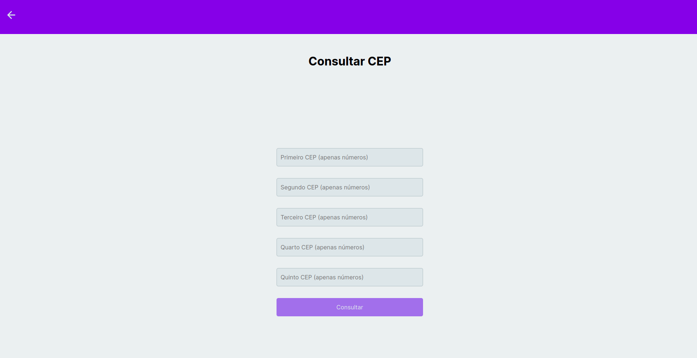

# FRONT END

## Descrição
Front End construído com React (utilizando o Vite), além de outras tecnologias e ferramentas.

## Tecnologias utilizadas

<ul>
  <li>React</li>
  <li>Typescript</li>
  <li>Styled Components</li>
  <li>React Hook Form</li>
  <li>Axios</li>
  <li>entre outras...</li>
</ul>

<br>

## Funcionalidades

<ul>
  <li>Consultar CEP;</li>
  <li>Calcular troco;</li>
  <li>Listar números palíndromos dentro de um intervalo;</li>
  <li>Cadastrar veículos;</li>
  <li>entre outras...</li>
</ul>

<br>

## Pré-requisitos

Antes de executar a aplicação (caso queira criar sua própria versão), atente-se aos requisitos:
* Ter instalada a versão mais recente do `<Node.js e Yarn>`

<br>

## Executando o Projeto

Para acessar o projeto (pela vercel), basta clicar <a target="_blank" href="https://frontend-teste-nine.vercel.app/">aqui</a>.<br>
Para acessar o projeto (pela netlify), basta clicar <a target="_blank" href="https://cool-alpaca-fac15e.netlify.app/">aqui</a>.

Agora, caso queira executar localmente, siga estas etapas:

1. Instale os pacotes<br>
```
>> yarn
```

ou <br>

```
>> npm install
```
<br>
2. Agora, é só executar os comandos:<br><br>

Para rodar a aplicação:
```
>> yarn dev
```

ou <br>

```
>> npm run dev
```

Pronto!

## PREVIEW


<br /><br />


<br /><br />


<br />


<br /><br />


<br /><br />


<br /><br />
